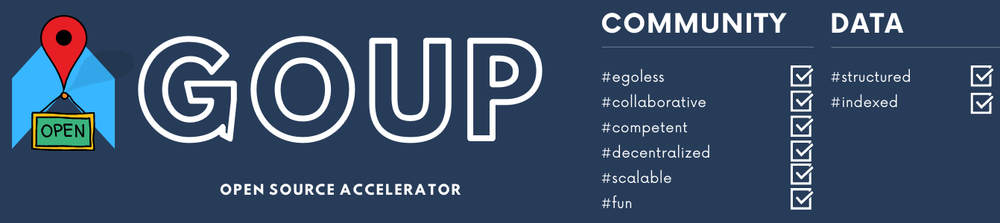
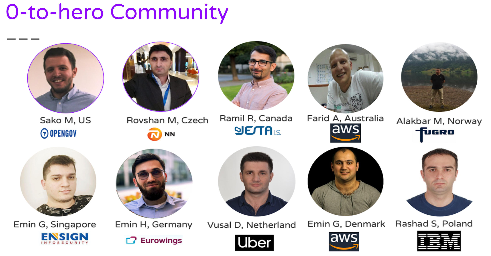
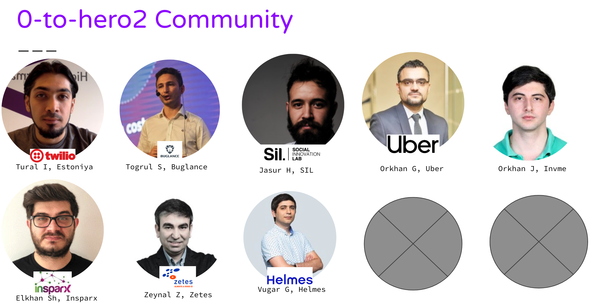

# Azerbaijani TechMentors living across the world

IT üzrə "Open Source" layihəsinə xoş gəldiniz.

- [Haqqımızda](#haqqımızda)
- [Əlaqə](#Əlaqə)

## Chapter01 June-August 2019

|No| Topic | PPT|Video |Tarix|Moderator|Ölkə|
|------|----------------------|---------|---|-----|-----|------|
|1| IT sahəsində global karyera|[Slides](slides/chapter01/Session01_SakoM.pdf)|[Session01](https://www.youtube.com/watch?v=Kvr1S4USXOI)|01 İyun 2019|[Sako M](https://www.linkedin.com/in/sakom/)|Amerika|
|2| Bulud Texnologiyaları|[Slides](slides/chapter01/Session02_RovshanM.pdf)|[Session02](https://youtu.be/amnGyiPqJQ0)|15 İyun 2019|[Rovshan Musayev](https://www.linkedin.com/in/rovshan-musayev/)|Çexiya|
|3| Database Texnologiyaları|[Slides](slides/chapter01/Session03_RamilR.pdf)|[Session03](https://www.youtube.com/watch?v=iDgi0R5HylE)|22 İyun 2019|[Ramil Rahimov](https://www.linkedin.com/in/ramilrahimov/)|Kanada|
|4| Network Texnologiyaları|[Slides](slides/chapter01/Session04_FaridA.pdf)|[Session04 Part 1](https://www.youtube.com/watch?v=XEzTDyF5LGw)[Session04 Part 2](https://www.youtube.com/watch?v=B-FYFbIM6tw)|29 İyun 2019|[Farid Akhundov](https://www.linkedin.com/in/farid-akhundov-34925b4b/)|Avstraliya|
|5| DevOps|[Slides](slides/chapter01/Session05_AlakbarM.pdf)|[Session05](https://www.youtube.com/watch?v=w4Qqg1DIOM0)|06 İyul 2019|[Alakbar Mammadov](https://www.linkedin.com/in/alakbarm/)|Norveç|
|6| Microservices Architecture|[Slides](slides/chapter01/Session06_EminH.pdf)|[Session06](https://www.youtube.com/watch?v=YzXuyDpUo9E)|13 İyul 2019|[Emin Hasanov](https://www.linkedin.com/in/eminhasanov/)|Almaniya|
|7| System Engineering/Software Architecture|[Slides](slides/chapter01/Session07_EminQ.pdf)|[Session07](https://youtu.be/s6FXRsO3mqs)|20 İyul 2019|[Emin Quliyev](https://www.linkedin.com/in/emin-ghuliev-461a22129/)|Azərbaycan|
|8| Alqoritmlər, İnterviyu hazırlığı|[Slides](slides/chapter01/Session08_VusalH.pdf)|[Session08](https://www.youtube.com/watch?v=KoAuS2A1j9Y)|27 İyul 2019|[Vusal Ahmadoglu](https://www.linkedin.com/in/vusaldadalov/)|Hollandiya|
|9|Design ve Behave hazirligi|[Slides](slides/chapter01/Session09_EminG.pdf)|[Session09](https://youtu.be/z_O_AZhNqdQ)|03 Avqust 2019|[Emin Guliyev](https://www.linkedin.com/in/eminguliyev/)|Almaniya|
|X| IT Security Texnologiyaları|[Slides](slides/chapter01/Session10_RashadS.pdf)|[SessionX](https://www.youtube.com/watch?v=njEZV81T4k4)|11 Avqust 2019|[Rashad Suleymanov](https://www.linkedin.com/in/rashad-suleymanov-b7293a41/)|Polşa|

## Chapter02  September-November 2019

|No| Topic | PPT|Video |Tarix|Moderator|Ölkə|
|------|----------------------|---------|---|-----|-----|------|
|1|Proqramlaşdırmaya giriş |N/A|[Session01](https://www.youtube.com/watch?v=9Vr0ZdYCM70&feature=youtu.be)|08 September 2019|[Tural Ismayilzade](https://www.linkedin.com/in/turalismailzadeh/)|Estoniya|
|2|Təhsil sisteminin uğursuzluğumuzda rolu|N/A|[Session02](https://www.youtube.com/watch?v=N9hCfpJ9zBQ)|15 September 2019|[Togrul Samad](https://www.linkedin.com/in/togsam/?msgConversationId=6575044465281519616&msgOverlay=true)|UAE|
|3|Bəlkə öz biznesim?|N/A|[Session03](https://www.youtube.com/watch?v=FsMBZDWG-mo)|22 September 2019|[Jasur Hasanov](https://www.linkedin.com/in/jasurhasanov/)|Azərbaycan|
|4|Hüquqdan Uber Muhendisliyinə keçid|[slides](slides/chapter02/Session04_OrkhanG.pdf)|[Session04](https://www.youtube.com/watch?v=vusvbB1OfGs)|29 September 2019|[Orkhan Gasimli](https://www.linkedin.com/in/ogasimli/)|Amerika|
|5|Happy Frontend |[slides](slides/chapter02/Session05_OrkhanJ.pdf)|[Session 05]( https://youtu.be/5wsd_Yklzys)| 06 October, 12.00 Baku TZ|[Orkhan Jafarov](https://www.linkedin.com/in/orkhan-jafarov-b8792627/)|Azərbaycan|
|6|Software Design Patterns |[slides](slides/chapter02/Session06_ZeynalZ.pdf)|[Session 06](https://www.youtube.com/watch?v=wx3q1tKI3bs)| 13 October 2019|[Zeynal Zeynalov](https://www.linkedin.com/in/zeynal/)|Almaniya|
|7|Stream Processing |[slides](slides/chapter02/Session07_ElkhanS.pdf)|[Session 07](https://youtu.be/RQBDicJkbIUs)| 20 October 2019|[Elkhan Shahverdi](https://www.linkedin.com/in/elkhan-shahverdi-59356166/)|Estoniya|
|8|The Pragmatic Programmer |[slides](slides/chapter02/Session08_VugarG.pdf)|[Session 08](https://www.youtube.com/watch?v=Mb-o16zY2do)| 27 October 2019|[Vugar Gasimov](https://www.linkedin.com/in/vugargasimov/)|Estoniya|
|9|IT Tehlukesizlik|[slides](slides/chapter02/Session09_.pdf)|[Session 09](https://www.youtube.com/watch?v=yrFyUEtjJBw)| 02 November 2019 21:00|[Fikret Kerimli](https://www.linkedin.com/in/fikrat-karimli-msc-oscp-cissp-ccsp-67aa7a104/)|Amerika|
|XX|Artificial Intelligence |[slides](slides/chapter02/SessionXX_.pdf)|[Session XX](XXX)| 03 November 2019 09:00|[Rustam Hashimov](https://www.linkedin.com/in/rustam-hashimov-2a05593a/)|Amerika|

© 2019 GOUP. Bütün hüquqlar qorunur.

## Haqqımızda

### Biz kimik?
GOUP layihəsi xaricdə yaşayan və IT sahəsində çalışan bir qrup  təcrübəli komandanın ideyasıdır. Layihənin əsas məqsədi Azərbaycanda "Open Source" resursların inkişafı, bu sahədə xaricdə əldə etdiyimiz təcrübənin sizlərlə paylaşılmasıdır.

### Missiya
Xarici və yerli bazarda IT sahəsində çalışan mütəxəsislərimiz arasında körpülər qurmaq

### Vizyon
Xarici bazarlara çıxacaq Azərbaycan Gəncliyini hazırlamaq.  
Yerli Startup infrastrukturunun inkişafı
Texnoloji yenilikləri isti-isti sizlərə çatdırmaq

### Obyektiv
Hədəfimiz çox sadədir IT sahəsinin inkişafını surətləndirmək və ən böyük auditoriyanı toplamaq.

## Əlaqə
Buyurub, aşağıdakı əlaqə vasitələri ilə bizimlə əlaqə saxlaya bilərsiniz:

Slack Qrupumuz : https://goupaz.slack.com

Slack Qrupumuza Qoşul! [link](https://join.slack.com/t/goupaz/shared_invite/enQtMjU1MjM5MDc2MzQxLWJkMTZiMGFhZDA3ZDkwZTgxMDNhMzc4YjFkZTBjZGMxZmQxYzA0NjEyMDM1ODVjMTBiYWUxN2UzMDVlNmYzMjU)

Youtube : https://www.youtube.com/goupaz

Facebook : https://www.facebook.com/goupaz

