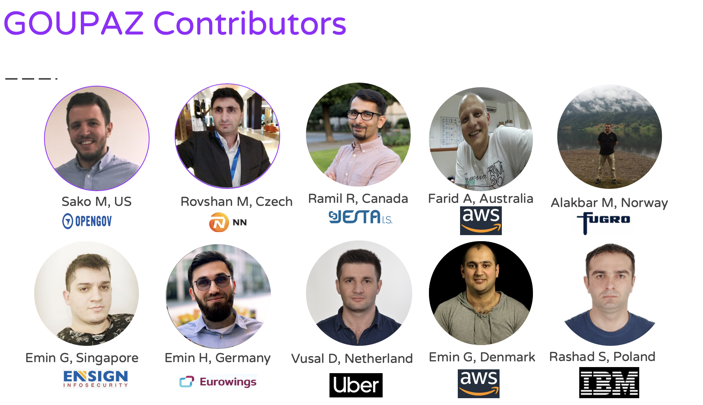

# GOUP - _GO UP!_

Dəyərli istifadəçilərimiz,

IT üzrə "Open Source" layihəsinə xoş gəldiniz. 

- [Haqqımızda](#haqqımızda)
- [Əlaqə](#Əlaqə)

# Chapter01

|No| Topic | PPT|Video |Tarix|Moderator|Ölkə|
|------|----------------------|---------|---|-----|-----|------|
|1| IT sahəsində global karyera|[Slides](slides/session01.pdf)|[Session01](https://www.youtube.com/watch?v=Kvr1S4USXOI)|01 İyun 2019, 09:00-10:00AM Baku TZ|[Sako M](https://www.linkedin.com/in/sakom/)|Amerika|
|2| Bulud Texnologiyaları|[Slides](slides/Session02.pdf)|[Session02](https://youtu.be/amnGyiPqJQ0)|15 İyun 2019, 11:00-11:45AM Baku TZ|[Rovshan Musayev](https://www.linkedin.com/in/rovshan-musayev/)|Çexiya|
|3| Database Texnologiyaları|[Slides](slides/session03.pdf)|[Session03](https://www.youtube.com/watch?v=iDgi0R5HylE)|22 İyun 2019, 18:00-18:45AM Baku TZ|[Ramil Rahimov](https://www.linkedin.com/in/ramilrahimov/)|Kanada|
|4| Network Texnologiyaları|[Slides](slides/Session04_FaridAkhundov.pdf)|[Session04 Part 1](https://www.youtube.com/watch?v=XEzTDyF5LGw)[Session04 Part 2](https://www.youtube.com/watch?v=B-FYFbIM6tw)|29 İyun 2019, 11:00-11:45AM Baku TZ|[Farid Akhundov](https://www.linkedin.com/in/farid-akhundov-34925b4b/)|Avstraliya|
|5| DevOps|[Slides](slides/session05_AlakbarM.pdf)|[Session05](https://www.youtube.com/watch?v=w4Qqg1DIOM0)|06 İyul 2019, 18:00-18:45AM Baku TZ|[Alakbar Mammadov](https://www.linkedin.com/in/alakbarm/)|Norway|
|6| Microservices Architecture|[Slides](slides/EminH_microservice.pdf)|[Session06](https://www.youtube.com/watch?v=YzXuyDpUo9E)|13 İyul 2019, 11:00-11:45|[Emin Hasanov](https://www.linkedin.com/in/eminhasanov/)|Almaniya|
|7| System Engineering/Software Architecture|[Slides](slides/session07-Eminus.pdf)|[Session07](https://youtu.be/s6FXRsO3mqs)|20 İyul 2019, 11:00-11:45AM Baku TZ|[Emin Quliyev](https://www.linkedin.com/in/emin-ghuliev-461a22129/)|Azerbaijan|
|8| Alqoritmlər, İnterviyu hazırlığı|[Slides](slides/VusalH.pdf)|[Session08](https://www.youtube.com/watch?v=KoAuS2A1j9Y)|27 İyul 2019, 11:00-11:45AM Baku TZ|[Vusal Ahmadoglu](https://www.linkedin.com/in/vusaldadalov/)|Hollandiya|
|9|Design ve Behave hazirligi|[Slides](slides/session09_emin_guliyev.pptx)|[Session09](https://youtu.be/z_O_AZhNqdQ)|03 Avqust 2019, 11:00-11:45AM Baku TZ|[Emin Guliyev](https://www.linkedin.com/in/eminguliyev/)|Germany|
|X| IT Security Texnologiyaları|[Slides](slides/session10-Rashad.pdf)|[SessionX](https://www.youtube.com/watch?v=njEZV81T4k4)|11 Avqust 2019, 12:00-12:45AM Baku TZ|[Rashad Suleymanov](https://www.linkedin.com/in/rashad-suleymanov-b7293a41/)|Polsha|

# Chapter02

|No| Topic | PPT|Video |Tarix|Moderator|Ölkə|
|------|----------------------|---------|---|-----|-----|------|
|1| Proqramlaşdırmaya giriş |[Slides]()|[Session01]()|08 September 2019, 12:00-13:00 Baku TZ|[Tural Ismayilzade](https://www.linkedin.com/in/turalismailzadeh/)|Estoniya|
|2| Təhsil sisteminin uğursuzluğumuzda rolu||[slides]|()|Session02|()|15 September, 12.00-13.00 Baku TZ|[Togrul Samad](https://www.linkedin.com/in/togsam/?msgConversationId=6575044465281519616&msgOverlay=true) 
© 2019 GOUP. Bütün hüquqlar qorunur.

# Haqqımızda

### Biz kimik?

GOUP layihəsi xaricdə yaşayan və IT sahəsində çalışan bir qrup  təcrübəli komandanın ideyasıdır. Layihənin əsas məqsədi Azərbaycanda "Open Source" resursların inkişafı, bu sahədə xaricdə əldə etdiyimiz təcrübənin sizlərlə paylaşılmasıdır.  

### Missiya
Xarici və yerli bazarda IT sahəsində çalışan mütəxəsislərimiz arasında körpülər qurmaq

### Vizyon
Xarici bazarlara çıxacaq  Azərbaycan Gəncliyini hazırlamaq.   
Yerli Startup infrastrukturunun inkişafı
Texnoloji yenilikləri isti-isti sizlərə çatdırmaq

### Obyektiv
Hədəfimiz çox sadədir IT sahəsinin inkişafını surətləndirmək və ən böyük auditoriyanı toplamaq. 

## Əlaqə

Buyurub, aşağıdakı əlaqə vasitələri ilə bizimlə əlaqə saxlaya bilərsiniz:

Slack Qrupumuz:
https://goupaz.slack.com

Slack Qrupuna Dəvət [link](https://join.slack.com/t/goupaz/shared_invite/enQtMjU1MjM5MDc2MzQxLWRjMDFlMTNhNjBhZWY4YWVlNThlNTY5NWJhNWY0NzA3ZDk5MTVjZDVhMGIyMGUyZWFlMDE1M2ZmYTBhYjRhYTI)

Youtube Səhifəmiz: https://www.youtube.com/goupaz
